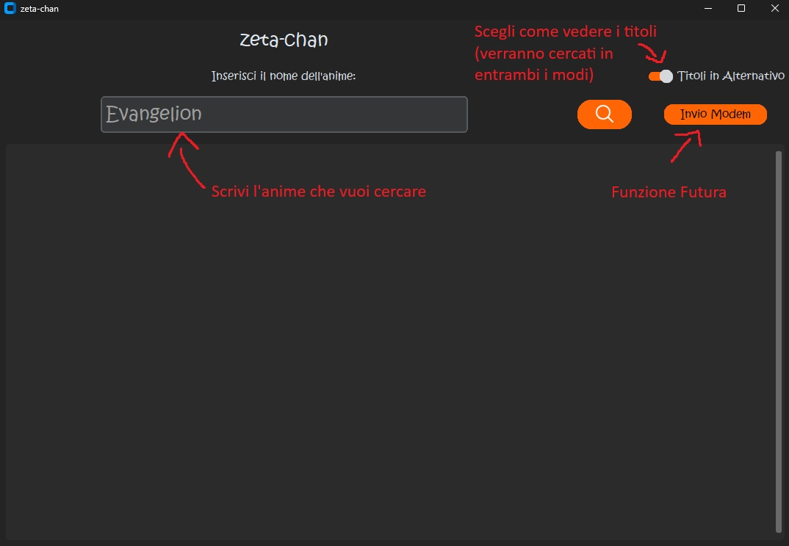
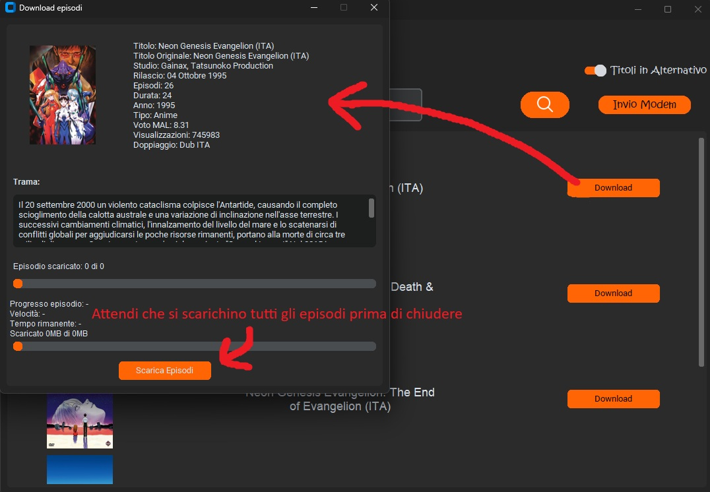

# zDownloader-chan
Essando il sito di AnimeWorld italiano, il readme è scritto in italiano.
zDownloader-chan è un semplice tool per scaricare anime da [AnimeWorld](https://www.animeworld.tv/) sfruttando il **multiprocesso** per velocizzare il download.

[](https://paypal.me/zgenny?country.x=IT&locale.x=it_IT)

## Perchè?
Il programma permette di scaricare **l'intera serie** con un solo click, senza dover selezionare manualmente ogni episodio. Grazie al multiprocesso, il download è **notevolmente** più rapido. L'idea è nata per consentire la visione degli anime sul mio home server. In futuro, una funzionalità prevista sarà l'invio automatico della serie direttamente all'home server.

# Foto

Ecco un esempio di come appare il programma:


Ecco invece un esempio di come appare il programma quando si vuole scaricare un episodio:


## Installazione

1. Clona il repository:
   ```bash
   git clone https://github.com/tuo-username/zDownloader-chan.git
   cd zDownloader-chan
   ```

2. Crea un ambiente virtuale Python:
   ```bash
   python3 -m venv venv
   source venv/bin/activate  # Su Windows: venv\Scripts\activate
   ```

3. Installa le dipendenze:
   ```bash
   pip install -r requirements.txt
   ```

## Utilizzo

Avvia il programma con:
   ```bash
   python3 ./main.py
   ```

Si avvierà la GUI del programma, da qui potrai cercare il tuo anime da voler scaricare e cliccare sul pulsante "Download" per scaricare **TUTTA** la serie.

## Note
- Per ora il programma non è stato testato troppo, quindi potrebbero esserci dei bug. Nel caso, apri pure una issue 😃

## Licenza
Questo progetto è distribuito sotto licenza MIT.

---
**Disclaimer:** Questo software è fornito solo a scopo educativo. L'uso improprio potrebbe violare i termini di servizio di AnimeWorld. L'autore non si assume alcuna responsabilità per eventuali violazioni.

