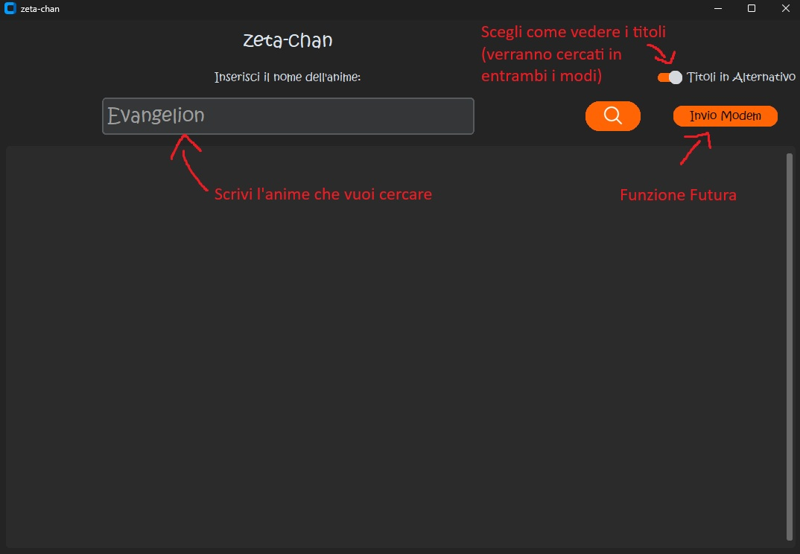

# zDownloader-chan
Essendo il sito di AnimeWorld italiano, il readme è scritto in italiano.
zDownloader-chan è un semplice tool per scaricare anime da [AnimeWorld](https://www.animeworld.tv/) sfruttando il **multiprocesso** per velocizzare il download.

## Perché?

zDownloader-chan nasce per semplificare il download degli anime da AnimeWorld.
Il programma consente di scaricare **un’intera serie con un solo click**, evitando
la selezione manuale dei singoli episodi.

Grazie all’uso del **multiprocesso**, i download risultano **notevolmente più rapidi**.
L’idea è nata per consentire la visione degli anime sul mio **home server**; in futuro
è prevista anche una funzionalità di **invio automatico della serie direttamente al server**.

## Screenshot

**Schermata principale**
<br>


**Download episodio**
<br>


## Installazione

1. Clona il repository:
   ```bash
   git clone https://github.com/tuo-username/zDownloader-chan.git
   cd zDownloader-chan
   ```

2. Crea un ambiente virtuale Python:
   ```bash
   python3 -m venv venv
   source venv/bin/activate  # Su Windows: venv\Scripts\activate
   ```

3. Installa le dipendenze:
   ```bash
   pip install -r requirements.txt
   ```

## Utilizzo

Avvia il programma con:
   ```bash
   python3 ./main.py
   ```


### Configurazione

Per configurare l'URL del sito anime o altri parametri, consultare la [documentazione di configurazione](Config.md).

Esempio rapido per cambiare l'URL base:
```bash
# Via variabile d'ambiente (temporanea)
export ANIMEWORLD_BASE_URL=https://www.nuovo-sito-anime.it
python3 ./main.py
```

Oppure modificare il file `libs/config.json`:
```json
{
  "base_url": "https://www.nuovo-sito-anime.it",
  ...
}
```

Si avvierà la GUI del programma, da qui potrai cercare il tuo anime da voler scaricare e cliccare sul pulsante "Download" per scaricare **TUTTA** la serie.

## Problemi noti

### Errore di build di Pillow su Fedora ([Pillow build fails (#1)](https://github.com/zGenny/zDownloader-chan/issues/1))

Su alcune versioni di Fedora (es. Fedora 43), Pillow può fallire in fase di build
a causa della mancanza di librerie di sistema.

**Risoluzione:**

Installare le dipendenze necessarie:

```bash
sudo dnf install libjpeg-turbo-devel zlib-devel python3-devel gcc
```
#### In caso di altri problemi, non esitare ad aprire una issue 😃

## Licenza
Questo progetto è distribuito sotto licenza MIT.

## Donazioni
[](https://paypal.me/zgenny?country.x=IT&locale.x=it_IT)

---
**Disclaimer:** Questo software è fornito solo a scopo educativo. L'uso improprio potrebbe violare i termini di servizio di AnimeWorld. L'autore non si assume alcuna responsabilità per eventuali violazioni.

